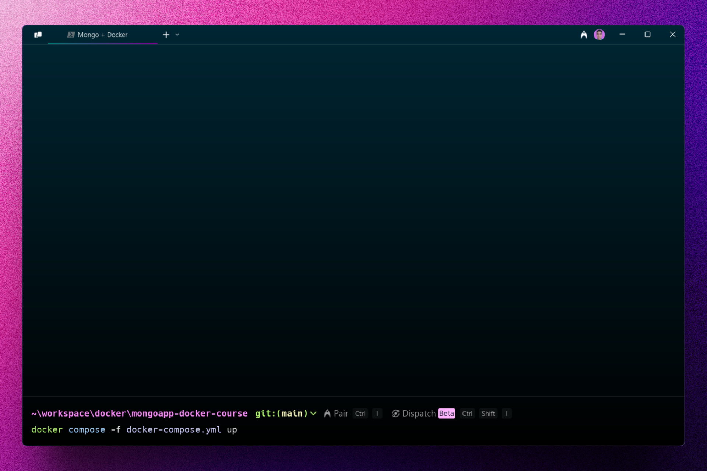
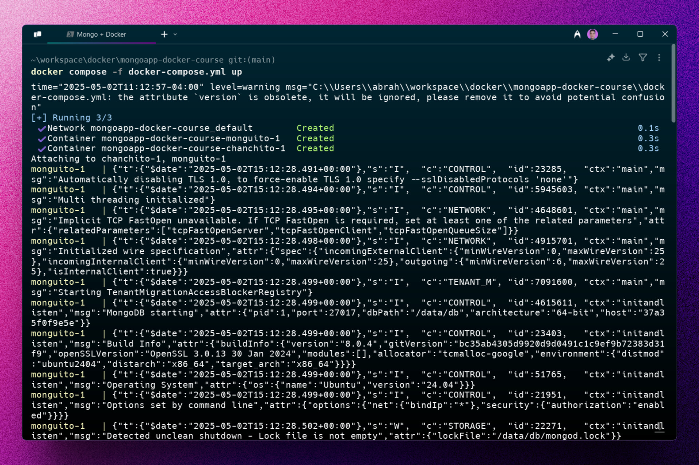
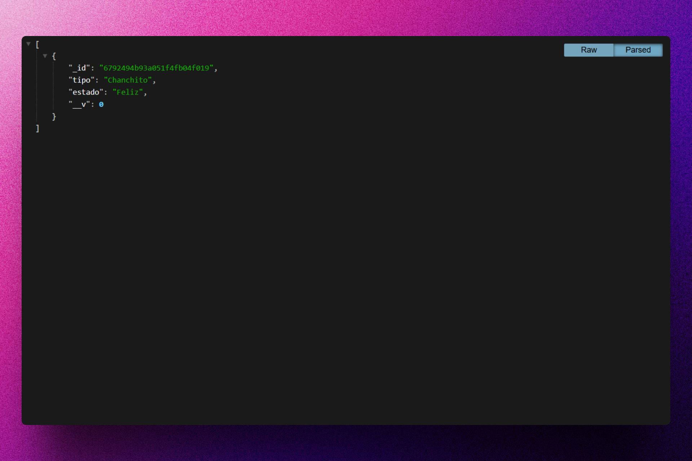

<div align='center'>

# 🐋 Docker: Mongo App

</div>

### Aplicación sencilla para aprender los primeros pasos con Docker.







## 🚀 Descripción

Este es un pequeño proyecto que utiliza Docker para crear una aplicación sencilla con Node.js y MongoDB, utilizando Express.js como framework de backend.

La aplicación tiene entorno de ejecución con hot reload y entorno de producción, todo integrado con Docker Compose.

## ⚡ Comenzar

### Prerrequisitos

1. Git.
2. Docker Desktop.

## 🔧 Instalación

### Usando Docker

1. **Clona el repositorio:**

   ```bash
   git clone https://github.com/abrahamgalue/mongoapp-docker-course.git
   cd mongoapp-docker-course
   ```

### Ejecución local (modo desarrollo)

1. **Inicia el servidor de desarrollo:**

   ```bash
   docker compose -f docker-compose-dev.yml up
   ```

   Esto iniciará el servidor de desarrollo en el Docker Engine y tu aplicación estará disponible en `http://localhost:3000`.

2. **Detén el servidor de desarrollo:**

   ```bash
   docker compose -f docker-compose-dev.yml down
   ```

   Esto detendrá el servidor de desarrollo.

## Ejecución local (modo producción)

1. **Inicia el servidor de producción:**

   ```bash
   docker compose -f docker-compose.yml up
   ```

   Esto iniciará el servidor de producción en el Docker Engine y tu aplicación estará disponible en `http://localhost:3000`.

2. **Detén el servidor de desarrollo:**

   ```bash
   docker compose -f docker-compose.yml down
   ```

   Esto detendrá el servidor de producción.

## 🎭 Tecnologías

El proyecto utiliza las siguientes tecnologías:

- [**Docker**](https://www.docker.com/) Para construir y ejecutar los proyectos.
- [**Docker Desktop**](https://www.docker.com/products/docker-desktop/) Herramienta necesaria para ejecutar Docker Engine en ambiente de escritorio.
- [**Docker Hub**](https://hub.docker.com/) Para buscar los contenedores que se van a utilizar.
- [**Express**](https://expressjs.com/) como framework de Node.js.
- [**MongoDB**](https://www.mongodb.com/) como base de datos NoSQL.